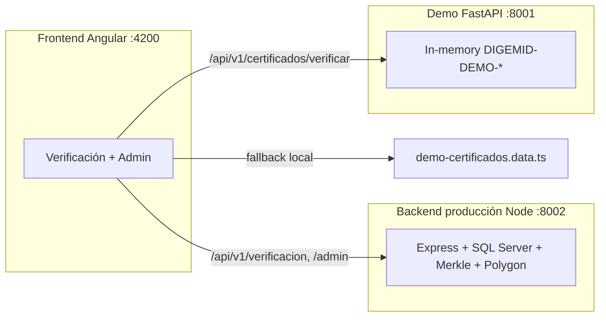

# Certificados Digitales DIGEMID

Aplicación para **verificación pública** de certificados farmacéuticos (QR), **panel administrativo** interno y respaldo **blockchain** (Polygon).

## Arquitectura



| Componente | Stack | Puerto | Uso |
|------------|-------|--------|-----|
| **Frontend** | Angular 18, Tailwind, Signals | 4200 | UI pública + panel admin |
| **Backend producción** | Node/Express/TS, SQL Server, ethers | **8002** | Verificación UUID, admin, anclaje Polygon |
| **Demo FastAPI** | Python/FastAPI in-memory | 8001 | Solo códigos legacy `DIGEMID-DEMO-*` (opcional; hay fallback local) |

## URLs de demo

| URL | Descripción |
|-----|-------------|
| `http://localhost:4200/verificar/DIGEMID-DEMO-001` | HABILITADO + VERIFICADO |
| `http://localhost:4200/verificar/DIGEMID-DEMO-002` | NO HABILITADO + ALTERADO |
| `http://localhost:4200/auth/login` | Login demo → panel admin |
| `http://localhost:4200/app/certificados` | Panel: métricas, tabla, transacciones |

Códigos demo: `DIGEMID-DEMO-001` … `005`. Verificación por UUID (producción): ver [`backend/data/README.md`](backend/data/README.md).

## Cómo ejecutar (Windows / PowerShell)

Necesitas **dos terminales** (backend producción + frontend). El demo FastAPI es **opcional** para códigos `DIGEMID-DEMO-*`.

### 1) Backend producción (Node) — puerto 8002

```powershell
cd backend
npm install
copy .env.example .env   # completar DB_* y WALLET_* (ver DATOS_SENSIBLES.md)
npm run db:seed          # primera vez
npm run dev
```

Verifica: http://localhost:8002/api/v1/health

### 2) Frontend (Angular) — puerto 4200

```powershell
cd frontend
pnpm install
pnpm start
```

Abre: http://localhost:4200/verificar/DIGEMID-DEMO-001

El proxy ([`frontend/proxy.conf.json`](frontend/proxy.conf.json)) enruta:
- `/api/v1/admin`, `/api/v1/verificacion`, `/api/v1/jobs`, `/api/v1/blockchain` → `:8002`
- `/api/v1/certificados` → `:8001` (demo FastAPI, opcional)

### 3) Demo FastAPI (opcional) — puerto 8001

```powershell
cd backend/demo-fastapi
python -m venv .venv
.\.venv\Scripts\Activate.ps1
pip install -r requirements.txt
.\.venv\Scripts\python.exe -m uvicorn main:app --reload --port 8001
```

Ver [`backend/demo-fastapi/README.md`](backend/demo-fastapi/README.md).

## Estructura del repo

```
Blockchain Proyect/
├── README.md
├── backend/                 ← Producción (Node/Express, :8002)
│   ├── src/
│   ├── contracts/
│   ├── data/
│   └── demo-fastapi/        ← Demo Python in-memory (:8001)
└── frontend/                ← Angular 18 cert-demo
```

## Seguridad

- **Nunca** commitear `.env` con secretos reales (ya en `.gitignore`).
- La clave privada de wallet (`WALLET_PRIVATE_KEY`) solo en backend; en producción usar KMS/HSM.
- Ver [`backend/DATOS_SENSIBLES.md`](backend/DATOS_SENSIBLES.md) para la checklist completa.
